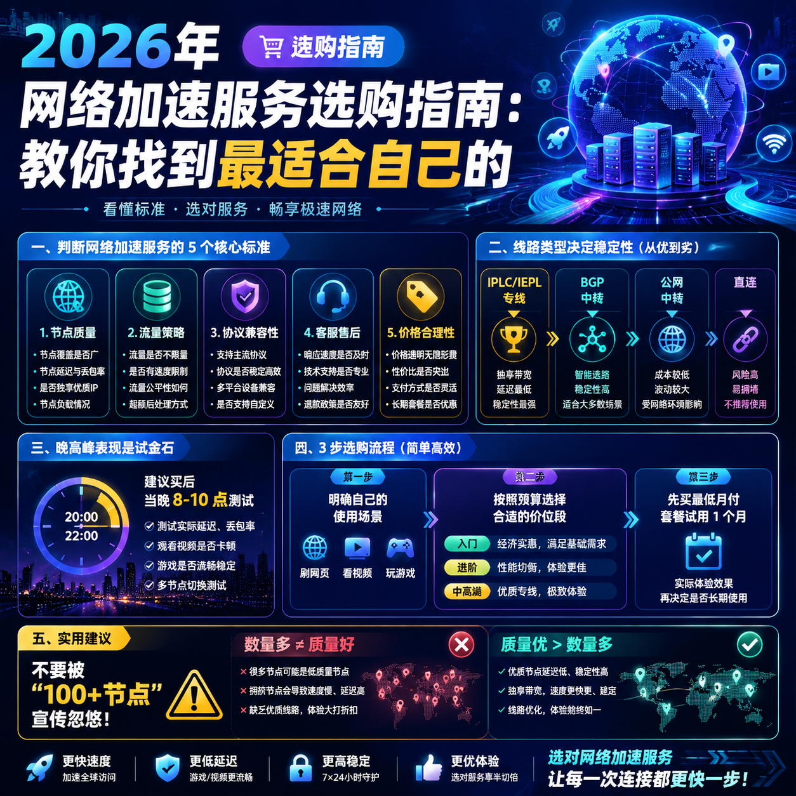

<!--
title: 2026年网络加速服务选购指南：教你找到最适合自己的
date: 2026-05-29
type: buying_guide
week: 0
style: 框架式：先给判断标准，再套用标准做推荐
fingerprint: a18eeb02f138b6f8e83eda0694e40d55
tags: 选购指南, 对比评测, 新手必看
-->

  
   2026-05-29 · 选购指南, 对比评测, 新手必看

 
# 2026年网络加速服务选购指南：别瞎买，先搞清楚这几点再掏钱

你有没有过这种经历？兴冲冲买了个加速服务，结果晚上8点一过，视频转圈、网页打不开、游戏延迟飙到300+。气得你想摔手机，但钱已经付了，退也不是，不用也不是。**别问我是怎么知道的，问就是踩了3年坑的血泪史。**

我从2020年开始接触网络加速服务，前前后后试过不下20家。月付从9.9到100多的都买过，踩过的坑包括：晚高峰卡成狗、接入点缩水、跑路失联、甚至被盗刷。**这篇文章我不吹任何一家，只把判断标准给你说清楚，帮你省下白花花的银子。**

---

## 一、先搞明白：什么样的加速服务才算“靠谱”？

很多人一上来就问“哪家快”，这其实是误区。**快慢只是表象，稳定和安全才是命根子。** 我用了一年半总结出5个判断标准，你对照着看，基本不会踩大坑。

### 1. 接入点质量 > 接入点数量
别被“100+接入点”这种宣传词忽悠了。**100个垃圾接入点不如5个好用的。** 我踩过最大的坑就是买了个号称“全球200接入点”的服务，结果80%都是落地机，晚高峰延迟破500ms，基本等于废物。

判断接入点质量看三点：
- **线路类型**：IPLC/IEPL专线 > BGP中转 > 公网中转 > 直连（基本废了）
- **晚高峰表现**：这是试金石。正常专线接入点晚高峰延迟增加不超过20ms，中转线增加50ms以内算及格
- **带宽冗余**：好服务商带宽冗余充足，坏服务商100人挤一条10Mbps线路，你说能不卡吗？

### 2. 流量策略要明明白白
有些服务商玩“流量倍率”的把戏。比如你买了100G流量，连日本接入点只扣0.2倍（扣20G），连香港扣1.5倍（扣150G），说白了就是在偷流量。**我之前用过一家，看个4K视频一个多小时扣了60G，血亏。**

**最佳策略：选择所有接入点倍率均为x1的服务，或者标明“不限倍率”。** 对于倍率不透明的服务，直接pass。

### 3. 协议和设备兼容性
2026年主流协议就几个：**Trojan、Shadowsocks、Vless**。支持Clash Meta、Surge、Shadowrocket这些主流客户端是基本要求。**别买只能用自己的定制客户端的，万一倒闭了你的配置全废。**

### 4. 客服和售后
**真人客服 > 机器人 > 没有**。我遇到过最离谱的，一周不回消息，问就是“技术在处理”。好的服务商应该能在一小时内响应你的问题，这是底线。

### 5. 价格是否合理
别贪便宜买“9.9元包年”的，基本一周跑路。也别盲目追贵，**月付20-40元是主流性价比区间**。我的建议：先买最便宜的月付套餐试用，别一上来就年付，这是铁律。

---

## 二、横向对比：我用过的几类服务，分别适合什么人？

明白标准之后，我给几个典型代表，每个都有优缺点，你自己对号入座。

### 入门级（月付15元以下）

| 服务名称 | 起步价 | 线路类型 | 适合谁 | 问题在哪 |
|---------|--------|---------|-------|---------|
| **[龙猫云](https://api.huanghaiwan.com/go/龙猫云)** | 15元/月 (100G) | IPLC专线 | 新手入门、预算有限 | 无试用期，冷门地区接入点少 |
| **[贝贝云](https://api.huanghaiwan.com/go/贝贝云)** | 11.9元/月 (100G) | 公网隧道中转 | 轻度使用、不玩游戏的 | 晚高峰可能拥堵 |
| **[新华云](https://api.huanghaiwan.com/go/新华云)** | 年付99元起 | 亚洲/欧洲/北美 | 全球多地区需求 | 线路质量一般 |

**我个人的看法：** 入门级首选是龙猫云。用了3个多月，IPLC专线确实稳，15元起步价对新手很友好。但注意它不提供试用，建议你买个最低月付试试水，别直接年付。

**适合人群：** 每天刷网页、看视频不超过2小时的轻度用户。
**不适合人群：** 游戏党、看4K视频的用户、对延迟极度敏感的人。

### 进阶级（月付15-40元）

| 服务名称 | 起步价 | 线路类型 | 核心优势 | 潜在问题 |
|---------|--------|---------|---------|---------|
| **[万达云](https://api.huanghaiwan.com/go/万达云)** | 13.9元/月 (150G) | IEPL+IPLC全专线 | 性价比极高、晚高峰不限速 | 接入点数较少（但质量好） |
| **[闪狐云](https://api.huanghaiwan.com/go/闪狐云)** | 20元/月 (120G) | BGP中转+IPLC出口 | 同价位质量优、不限设备数 | 2025年新上线，稳定性待验证 |
| **[Cyberguard](https://api.huanghaiwan.com/go/Cyberguard)** | 18元/月 (100G) | IEPL/IPLC/公网混合 | 协议新、有按量付费 | 无试用期，客户端兼容性一般 |
| **[肥猫云](https://api.huanghaiwan.com/go/肥猫云)** | 20元/月 (120G) | 全IEPL专线 | 高峰期表现好、接入点质量高 | 起步价稍高，无试用 |

**这个价位段是竞争最激烈的，也是性价比最卷的。** 我目前在用万达云和闪狐云俩个，一个当主力，一个当备胎。

万达云用了快半年，**全专线、晚高峰不限速、所有接入点倍率x1**，这三个点太香了。13.9元/150G的起步价，在同价位找不到第二个全专线的。只是接入点数不多，但每个都稳。

闪狐云是新出的，我买了3个月。BGP中转+IPLC出口的搭配不错，晚高峰确实不掉速。**唯一担心的是新服务商能不能撑住**，建议你先买一个月试试，别急着续。

**适合人群：** 中度用户、看4K视频、偶尔玩游戏、对稳定性有一定要求。
**不适合人群：** 重度游戏用户（延迟要求极严苛的）、图便宜的用户。

### 中高端（月付40-80元）

| 服务名称 | 起步价 | 线路类型 | 核心优势 | 潜在问题 |
|---------|--------|---------|---------|---------|
| **[悠兔](https://api.huanghaiwan.com/go/悠兔)** | 29元/月 (150G) | IEPL+家宽混合 | 线路丰富、老牌稳定 | 动态倍率扣流量快 |
| **[一枝红杏](https://api.huanghaiwan.com/go/一枝红杏)** | 价格偏高 | 专线/中转 | 10年老牌 | 价格偏高 |
| **[NXO Earth](https://api.huanghaiwan.com/go/NXO Earth)** | 高端价 | 全专线 | 稳定性顶级 | 价格贵，性价比低 |

这个价位段适合对速度有极致要求的人。悠兔我有个朋友在用，运营了4年多，稳定性确实好。**但动态倍率是痛点**，连香港接入点高峰期可能扣1.5倍流量，看起来便宜实际流量打折。

一枝红杏是10年老牌，经验丰富，但价格偏高，没有明显的性价比优势。

**适合人群：** 重度用户、电商从业者、对网速要求极高的人。
**不适合人群：** 性价比党、学生党。

---

## 三、新手避坑指南：我再给你4条保命建议

**1. 别信“包年优惠”，先买月度试用**

这是最重要的建议，没有之一。**所有服务商，包括我上面推荐的，都先买一个月试试。** 我吃过最大的亏就是被“年付八折”诱惑，结果用了两个月发现晚高峰卡成狗，剩下的10个月全浪费了。

**2. 建议备2-3个不同服务商**

别把鸡蛋放一个篮子里。就算最好的专线服务，也会偶尔维护、被攻击。我现在的方案是：一个主力（万达云）+ 一个备用（闪狐云）+ 一个极便宜保底（新华云年付）。主力出问题时，5分钟切备用，完全感觉不到中断。

**3. 用之前先测晚高峰**

买完服务的第一天，晚上8-10点之间，分别测下：YouTube 4K视频加载速度、网站打开速度、游戏Ping值。如果这个时间稳，白天肯定没问题。**如果晚高峰卡，那这个服务基本废了。**

**4. 关注流媒体解锁能力**

如果你看Netflix、Disney+、ChatGPT、TikTok，一定要选支持解锁的。**我见过很多服务虽然速度快，但香港IP解锁不了Netflix**，白白浪费流量。买之前问客服或者看网上实测。

---

## 总结一下

选网络加速服务，核心就三点：
- **线路质量**（专线 > 中转 > 直连）
- **晚高峰表现**（试金石）
- **价格和流量策略**（倍率x1最好）

入门选龙猫云或贝贝云（15元以下），进阶选万达云或闪狐云（13.9-20元），预算充足选悠兔或一枝红杏（30元以上）。

**最后再提醒一句：先试用，别年付。** 希望你别像我一样，花了几百块冤枉钱才学聪明。

**你目前在用什么服务？踩过哪些坑？评论区聊聊，我看到了都会回。**

---

<!-- article-data
key_points: 判断网络加速服务的5个核心标准：接入点质量、流量策略、协议兼容性、客服售后、价格合理性|线路类型决定稳定性：IPLC/IEPL专线>BGP中转>公网中转>直连|晚高峰表现是试金石，建议买后当晚8-10点测试|不建议购买动态倍率服务，选择所有接入点倍率均为x1的服务
steps: 第一步：明确自己的使用场景（刷网页/看视频/玩游戏）|第二步：按照预算选择合适的价位段（入门/进阶/中高端）|第三步：先买最低月付套餐试用1个月|第四步：在晚高峰时段测试接入点质量和流媒体解锁能力|第五步：根据测试结果选择2-3个服务商作为主力+备用组合
tips: 不要被“100+接入点”宣传忽悠，接入点质量远比数量重要|建议备2-3个不同服务商，防止单点故障|遇服务跑路或被盗刷，立即停止使用并及时更换密码|不要购买年付套餐，更安全的策略是先月度试用3个月以上
summary_items: 线路质量是决定体验的核心，专线永远优于中转|晚高峰测试是评估服务质量的试金石|先试用不年付是所有新手必须遵守的铁律|入门级15元/月、进阶级20元/月、中高端40元/月是主流性价比区间|建议组建主力+备用的服务组合，确保网络不中断
-->