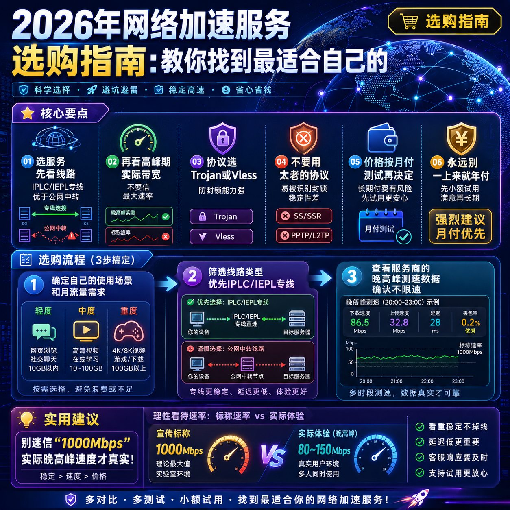

<!--
title: 2026年网络加速服务选购指南：教你找到最适合自己的
date: 2026-05-30
type: buying_guide
week: 0
style: 踩坑式：从自己买错的经验出发，教你怎么避坑
fingerprint: a1a4997a47565ca475232c53062d2f30
tags: 选购指南, 对比评测, 新手必看
-->

  
   2026-05-30 · 选购指南, 对比评测, 新手必看

 
> 你是不是也遇到过这种场景：刷了半小时测评，收藏了十几篇对比贴，最后还是不知道选哪个？我懂。3年前我第一次买网络加速服务，被那些"全专线""1000Mbps不限速""独家优化"的宣传词晃花了眼，脑子一热买了个**年付**套餐。结果呢？用了不到3个月，晚上8点准时卡成PPT，客服半天不回一句话，气得我直接丢了那个账号。从那以后，我学会了**先看门道再看面子**。

今天这篇，不跟你扯那些玄乎的参数，就从一个踩过无数坑的老用户角度，聊聊**2026年怎么选网络加速服务**。我会把判断标准拆开揉碎，再拿几个我用过而且还在用的服务商当例子。**重点是用框架帮你筛，不是无脑推**。看完这篇，至少能省你80%的试错钱。

---

## 第一步，先搞懂"专线"到底值不值钱？

很多人一上来就问："你家有没有专线？"好像专线就是万能仙丹。**真不是这样。** 😅

我花了大概两年，试了十几家，才摸清楚这里面的门道。简单分几类：

- **IPLC/IEPL专线**：简单说就是**物理线路**，大部分情况下服务器直连，不过中间接入点，所以延迟低、晚高峰不容易掉速。缺点是贵，一般起步价都在月付20元以上。
- **公网中转**：走的是云端协议栈中转，价格便宜（有的月付不到12元），但高峰期看命。我试过[贝贝云](https://api.huanghaiwan.com/go/贝贝云)，用起来平时凑合，但一到晚上9点延迟就往100ms以上窜。
- **家宽接入点**：模拟普通家庭宽带，适合注册账号、看流媒体。但跟"加速"这俩字关系不大，**我一般只把它当补充，不拿来当主力**。

**我的建议**：别盲目追专线。如果你只是刷刷网页、查查资料，公网中转完全够用。但如果你是**重度用户**（每天看视频、玩游戏、开会议），那专线绝对值得多花这几十块。

举个例子，我最近转用**[万达云](https://api.huanghaiwan.com/go/万达云)**，因为它有个很实在的配置：**IPLC/IEPL全专线，而且所有接入点的倍率都是x1**——这点很少人注意，但坑很大。有些服务商说"高速通道"，结果用一次流量扣两次，这算下来等于价格翻倍。万达云这点就做得干净，150G就是150G，不会耍花招。价格也合适：**月付13.9元起（150G）**，对新手挺友好。

---

## 第二步，别被"1000Mbps"忽悠了，看带宽要看"高峰期"

每次看到广告里写着"1000Mbps速率"我就想笑。**那是在凌晨3点，你家WiFi旁边没人的理想状态**。真实的场景是什么？晚上8点，你开个4K视频，电脑微信在响，手机还在刷微博。这时候，**很多服务商直接降速到残废**。

**怎么看带宽是否靠谱？**

- 第一步：**去他们的测速页面（如果有）看晚高峰（19:00-23:00）的速度**。不是最大速率，是平均水平。
- 第二步：问问客服——"晚高峰会限速吗？"要是他绕弯子，基本就是不限速但限流。
- 第三步：**看合同里有没有"无限速"的条款**。像**[闪狐云](https://api.huanghaiwan.com/go/闪狐云)**这种，我专门问过，明确说"晚高峰不限速"，而且新上线（2025年），为了口碑初期应该不会乱来。

我自己的经验是：**别选那种只给一个"超高速"测试结果的**。好服务商都会在官网或频道里晒真实的晚高峰测速图。如果没找到，直接私聊客服要测试接入点，**免费试用个几天再决定**。

---

## 第三步，协议这东西，选对了能省不少事

很多人不看协议，觉得"能用就行"。但在2026年，**协议选错可能直接导致服务被封**。

- **Trojan / Vless**：目前**防封锁能力最强**的协议。我用[肥猫云](https://api.huanghaiwan.com/go/肥猫云)（全IEPL专线）时，他们主推Trojan，用了大半年没出过问题。延迟也很稳，**香港接入点24ms**，基本感觉不到延迟。
- **Shadowsocks**：老牌协议，兼容性好，市面上几乎所有客户端都支持。但**抗干扰能力比Trojan弱一点**。如果你用的客户端比较老（比如15年前的），那SS更稳妥。
- **Open网络加速服务 / IKEv2**：不推荐。**慢、旧、易掉线**。除非服务商只有这个协议，否则直接跳过。

**我的建议**：如果你用的是最新版本的Clash Meta或Sing-box，选Trojan或Vless最安全。如果还是老客户端，或者要给家人用（比如父母），那选Shadowsocks更方便，**但一定记得每月更新订阅**。

还有个小细节：**看服务商是否支持一键导入**。像**[龙猫云](https://api.huanghaiwan.com/go/龙猫云)**支持Clash、Shadowrocket、Surge等常见客户端一键导入，这对新手就很友好，不用自己配复杂参数。龙猫云还有超给力的价格：**月付15元（100G）**，但对新手来说，这个起价门槛真的很香。

---

## 第四步，价格不是越贵越好，但"免费"一定别碰

我见过太多人为了省十几块，去用那些"永久免费"的服务。结果呢？**要么速度慢得跟拨号一样，要么干脆跑了链接直接失效**。**免费就是最贵的**，这句话在2026年依然成立。

**怎么定价合理？**

我根据自己的使用量，整理了一个参考表：

| 使用场景 | 建议月流量 | 参考价格（月付） |
| :--- | :--- | :--- |
| 轻度（偶尔刷网页、回消息） | 30-60G | 10-20元 |
| 中度（每天刷视频、开会议） | 100-200G | 15-35元 |
| 重度（4K视频流、游戏、日常办公） | 300-500G | 40-80元 |
| 超重度（全家使用、NAS下载） | 1000G+ | 80-150元 |

**我踩过的坑**：之前贪便宜买了个**月付8元的服务**，号称"不限流量"。结果用了半个月，速度从50Mbps掉到2Mbps，找客服永远在"排队"。最后只能扔了，钱白花。

**我的建议**：**先买最便宜的套餐测试1个月**。不要一上来就年付！很多服务商年付优惠很大，但你用了一个月发现不合适，钱就退不回来了。

比如你想试**[自由猫](https://api.huanghaiwan.com/go/自由猫)**（我目前的主力推荐之一），它的**起步套餐是8元/月**（30G左右），**先买1个月测试**。自由猫用的是IEPL + MPTCP多路复用技术，接入点超100个，延迟和稳定性都很在线。但我不建议你直接买年付——先试，觉得棒再考虑长期。

另外，有些服务商会明确拒绝免费试用，比如**肥猫云、[悠兔](https://api.huanghaiwan.com/go/悠兔)**。这也不一定是坏事，说明他们有底气和自信。但对你来说，**如果必须试用才能决定，就绕开他们**。

---

## 第五步，客服响应速度决定了你的"安全感"

再牛逼的服务，也可能在某个深夜出现故障。那时候，**客服就是你唯一的救命稻草**。我遇到过最离谱的事：**周五晚上11点接入点全崩，客服到周一上班才回消息**。那两天我直接失联。

**怎么判断客服靠不靠谱？**

- **看回复时间**：在非工作时间（比如凌晨1点）发个消息，看多久有回应。**好服务商通常30分钟内会有机器人回复，2小时内会有真人介入**。
- **看渠道**：有**在线客服**的优先选，其次是Telegram群组的管。群组里人多，但容易刷屏。
- **看态度**：别信"7x24小时服务"的宣传。真遇到故障，能10分钟响应、1小时之内出修复时间预估的，就算优秀。

我目前在用的**万达云**，客服响应特别快，而且有**真人在线客服**。上次我遇到一个小问题，晚上9点发消息，10分钟内就有人回，还帮我人工更新了订阅，体验很不错。

**另一个点**：**看他们在节假日是否也正常运营**。有些小团队，长假一放就是7天，服务崩了也无所谓。

---

## 总结：2026年最靠谱的选购方法

让我把上面一堆废话浓缩成**5个检查点**：

1. ✅ **先看线路**：IPLC/IEPL专线 > 公网中转 > 家宽
2. ✅ **再看带宽**：查晚高峰实际速度，**不要信最大速率**
3. ✅ **协议选择**：Trojan / Vless > Shadowsocks > 其他
4. ✅ **先试后付**：**月付>季付>年付**，永远不要一上来就年付
5. ✅ **客服质量**：响应速度 > 渠道丰富度 > 服务态度

我个人现在**日常主力用自由猫**，因为它线路稳、接入点多（100+），用MPTCP多路复用技术，高峰期也不掉链子；**新手入门如果想省钱**，我会推荐**万达云**（13.9元/月，全专线、全x1倍率），或者**龙猫云**（15元/月，IPLC专线、流媒体解锁好）。

最后说一句掏心窝的：**别因为便宜20块钱，去选一个你完全不了解的服务**。网络加速这件事，**稳定和靠谱比什么都重要**。你也不想在跟朋友开黑的时候突然掉线，或者在看重要视频会议时画面卡成PPT吧？

**收藏这篇文章，下次选服务的时候拿出来照着检查一遍**。有什么问题，欢迎在评论区留言，我看到就会回。咱们一起少踩坑，多省钱。💪

---

<!-- article-data
key_points: 选服务先看线路（IPLC/IEPL专线优于公网中转），再看高峰期实际带宽，不要信最大速率|协议选Trojan或Vless，防封锁能力强，不要用太老的协议|价格按月付测试再决定长期付，永远别一上来就年付|客服响应速度是服务质量的底线，深夜能快速回应的才算靠谱
steps: 第一步：确定自己的使用场景和月流量需求（轻度/中度/重度）|第二步：筛选线路类型，优先IPLC/IEPL专线|第三步：查看服务商的晚高峰测速数据，确认不限速|第四步：先买月付套餐测试1个月，不要直接年付|第五步：体验客服响应速度，深夜发消息看多久有回复
tips: 别迷信“1000Mbps”，实际晚高峰速度才真实|免费服务绝对不要用，速度慢且容易跑路|注意接入点倍率（x1最好），有些服务商用一次扣两次流量|客户端支持一键导入的，对新手更友好|选择有在线真人客服的服务商，比只有邮件回复的强
summary_items: 线路类型决定基础质量，IPLC/IEPL专线比公网中转靠谱，价格稍贵但值得|带宽要看高峰期表现，别被最大速率忽悠，实操测速才真实|协议选Trojan/Vless，兼容性和抗封锁能力都很强|先试后付是铁律，月付测试1个月再考虑长期订阅|客服响应速度是底线，深夜能秒回的才算靠谱
-->