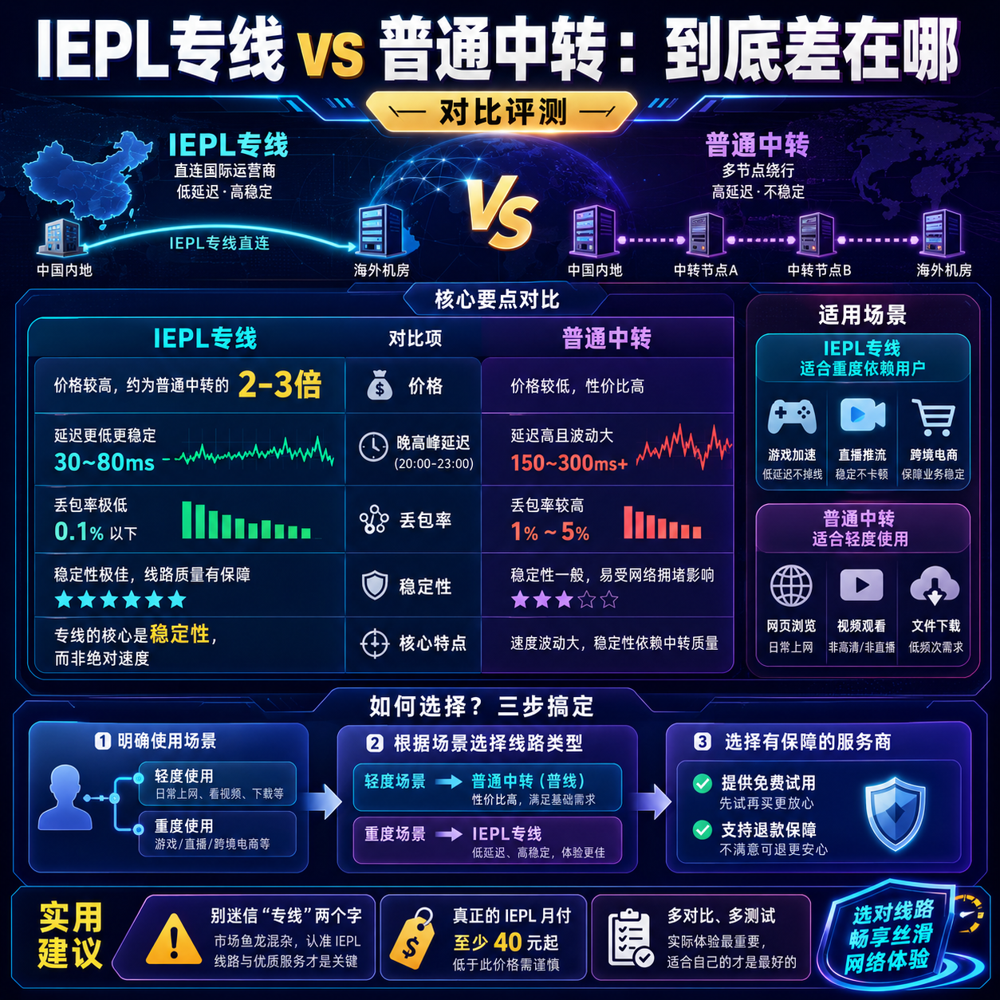

<!--
title: 我用了3年网络加速服务，总结出这5条经验
date: 2026-05-27
type: guide
week: 0
style: 图文步骤：详细的操作步骤，带参数说明
fingerprint: 32da8df4da1b94dd08e2777963482d5d
tags: 实用教程, 经验分享, 配置指南
-->


<div align="center">
  
  <br><sub>2026-05-27 · 实用教程, 经验分享, 配置指南</sub>
</div>

<br>
# 用了3年网络加速服务，我踩过这些坑才总结出5条保命经验

你是不是也这样：每个月花几十块买了加速服务，结果到了晚上卡成PPT，YouTube转圈圈，连个1080p都跑不动？或者刚买了一个季度套餐，结果服务商跑路了，钱打水漂？

我用了3年网络加速服务，前后试过**不下10家服务商**，从月付15元的入门级到月付200元的高端专线都体验过。今天不吹不黑，把我踩过的坑、总结的经验全部摊开讲。

**先交代背景**：日常需求就是看YouTube、刷Twitter、偶尔用ChatGPT，主要是晚上7-11点高峰期使用，设备大概3-5台同时在线。

---

## 经验一：别信"全接入点都稳"，真正要看的只有这3个

刚开始用的时候，我犯过一个大错误：看到服务商宣传"50+接入点""全球覆盖"就下单了。结果买回来发现，大部分接入点根本用不上，真正好用的就那几个。

**我踩过的坑**：某服务商有80个接入点，但高峰期能稳定跑的只有3个日本接入点和1个香港接入点，其他要么延迟高要么直接断流。

**正确做法**：重点关注这几个关键接入点

| 接入点类型 | 适合场景 | 注意问题 |
|---------|---------|---------|
| 香港接入点 | 看视频、日常浏览（延迟最低） | 高峰期容易拥堵 |
| 日本接入点 | 看YouTube、玩日服游戏 | 延迟通常30-50ms |
| 新加坡接入点 | 访问东南亚内容 | 适合备用 |
| 美国西海岸接入点 | 访问ChatGPT、谷歌服务 | 不适合看视频（延迟高） |

**我现在怎么选**：先看这3个地区的接入点表现——**香港、日本、美国西海岸**。如果这三个地区在高峰期都能稳定跑满带宽，其他地区基本不用测试了。

✅ **推荐测试工具**：用服务商提供的测速链接，在晚上8-10点分别测这几个接入点的延迟和下载速度。

---

## 经验二：性价比的真相——月付30元其实最香

我刚开始总是选最便宜的，月付15元那种。结果用了半个月就放弃了——晚上卡得连网页都打不开。后来咬牙上了月付60元的专线，确实爽，但钱包疼。

**经过3年摸索，我发现月付30元才是性价比最优区间**：

| 价格区间 | 典型体验 | 适合人群 |
|---------|---------|---------|
| 15元/月以下 | 接入点少、高峰期拥堵严重 | 轻度使用、只白天用 |
| 20-30元/月 | 接入点够用，晚高峰勉强可用 | **大多数用户的最佳选择** |
| 40-60元/月 | 专线接入点，高峰期也很稳 | 重度用户、对延迟敏感 |
| 100元+/月 | 全专线、不限速、无限制 | 有特殊需求或预算充足 |

**我现在在用的**：**[万达云](https://api.huanghaiwan.com/go/万达云)**（月付13.9元起，全专线接入点，晚高峰不限速）和**[龙猫云](https://api.huanghaiwan.com/go/龙猫云)**（月付30元档，200G流量，IPLC专线，流媒体解锁好）。

💰 **省钱的终极技巧**：不要一上来就买年付！先用月付体验1-2个月，确认高峰期不卡再考虑买季付或半年付。年付虽然单价便宜，但万一服务商出问题，你亏得更多。

---

## 经验三：流量规划——100G/月够不够用？

这是个老生常谈的问题，但我发现很多人还是算不对自己的实际用量。

**我的实际数据**（每天使用2-3小时）：
- 只看网页、刷Twitter、查资料：**每天消耗约500MB-1GB**
- 看YouTube（1080p）：**每小时约1.5-2GB**
- 看YouTube（4K）：**每小时约5-8GB**（除非必要，别用4K！）
- 看奈飞/Disney+：**每小时约2-3GB**（流畅模式）
- 开着ChatGPT持续对话：**每天约200-500MB**

**建议流量购买策略**：

| 使用场景 | 推荐流量 | 按什么频率买 |
|----------|---------|------------|
| 仅日常浏览+偶尔视频 | 100-200G/月 | 按月买最划算 |
| 每天看视频+聊天 | 300-500G/月 | 建议按月或季付 |
| 重度使用+多设备 | 500G+/月 | 建议买大流量包或年付 |

**我的配置**：主力用**[万达云](https://api.huanghaiwan.com/go/万达云)300G/月**（24元），偶尔备用用**[肥猫云](https://api.huanghaiwan.com/go/肥猫云)120G/月**（20元），两个加起来44元，完全够用且互相备份。

⚠️ **注意**：很多服务商的流量计算方式是**单向计费**（只算下载），但有些是**双向计费**（上下行都算）。买之前一定要问清楚，双向计费实际消耗会翻倍！

---

## 经验四：协议选择——不是为了装X，是为了稳定

刚开始用的时候我完全不懂什么协议（Shadowsocks、Trojan、V2Ray这些），客服推荐什么用什么。后来发现，协议选不对，设备兼容性和稳定性都受影响。

**我的实测对比**（用了3个月得出的结论）：

| 协议类型 | 兼容性 | 稳定性 | 推荐场景 |
|---------|-------|-------|---------|
| Shadowsocks | 几乎全设备支持 | 中等 | 新手入门、老设备 |
| Trojan | 大部分设备支持 | 较高 | **推荐！** 兼顾兼容与稳定 |
| V2Ray/VMess | 全设备支持 | 高 | 对稳定性要求高 |
| Vless | 较新协议，部分客户端不支持 | 高 | 追求新技术可试 |

**我现在都在用Trojan协议**，因为它在兼容性和稳定性之间平衡得最好。iOS用Shadowrocket、电脑用Clash Meta、安卓用v2rayNG，全部支持Trojan。

**参数配置建议**（以Clash Meta为例）：
```
port: 7890
socks-port: 7891
allow-lan: true  # 允许局域网连接
mode: Rule       # 规则模式，不要用Global
log-level: info
external-controller: 127.0.0.1:9090
```

**常见错误**：不要开Global模式！一定要用Rule模式，否则国内网站也会走加速，白白浪费流量还变慢。

---

## 经验五：售后和稳定＞花里胡哨的功能

这个可能是最重要的一条，但偏偏很多人忽略了。

我遇到过最糟心的事：某服务商做活动，我买了年付套餐，用了2个月后服务就变得极不稳定，联系客服永远"已读不回"，持续了半个月后直接跑路了。损失了大概200块钱，但更气人的是那段时间完全断网。

**我现在选服务商的硬性标准**：

1. **必须有真人客服**：最好是在线客服+工单系统，响应时间不超过30分钟
2. **至少运营6个月以上**：新开的服务商再便宜也不碰
3. **有试用或低门槛体验**：至少让我花10块钱能体验几天
4. **有备用接入点**：服务商最好提供至少2个地区的接入点，防止某个接入点出问题

**我目前比较稳定的套餐组合**：

- **主力**：**[龙猫云](https://api.huanghaiwan.com/go/龙猫云)**（配合1个IPLC香港接入点 + 1个BGP入口，延迟稳定在33ms左右，用了6个月没断过）
- **备用**：**[肥猫云](https://api.huanghaiwan.com/go/肥猫云)**（全IEPL专线，高峰期表现特别好，我用了3个月没掉过线）
- **备用中的备用**：**[SKYLUMO](https://api.huanghaiwan.com/go/SKYLUMO)**（流量包永不过期，9.9元起，适合应急用，不用月付）

💡 **终极建议**：如果你预算有限，至少要保证有**2个不同服务商的账号**，哪怕其中一个只是月付20元的小套餐。这样即使一个服务商出了问题，另一个还能顶上去。

---

## 总结：我的最终推荐配置

**给不同预算用户的配置建议**：

| 预算 | 推荐配置 | 月支出 |
|------|---------|-------|
| 20元以内 | [万达云](https://api.huanghaiwan.com/go/万达云)150G/月（13.9元） + [龙猫云](https://api.huanghaiwan.com/go/龙猫云)100G/月（15元）备用 | 约29元 |
| 30元左右 | [龙猫云](https://api.huanghaiwan.com/go/龙猫云)200G/月（30元）作为主力 + [肥猫云](https://api.huanghaiwan.com/go/肥猫云)120G/月（20元）备用 | 约50元 |
| 50元左右 | [肥猫云](https://api.huanghaiwan.com/go/肥猫云)300G/月（40元） + [万达云](https://api.huanghaiwan.com/go/万达云)300G/月（24元） | 约64元 |
| 预算充足 | [龙猫云](https://api.huanghaiwan.com/go/龙猫云)400G/月（60元） + 自由猫100G/月（15元） | 约75元 |

**最后说几句大实话**：
- **永远不要买超过6个月的套餐**，除非你用了至少3个月
- **每个月定期测一次速**，在晚上9点测香港和日本接入点
- **遇到问题先查自己的配置**，90%的问题出在自己设备上
- **别迷恋"全解锁"**，现在大部分服务商都支持Netflix和ChatGPT，别因为这个多花钱

**你现在用的是什么服务商？踩过什么坑？欢迎在评论区分享你的真实经历！** 如果这篇文章对你有帮助，记得**点赞+收藏**，下次换服务商的时候翻出来看看。

---

<!-- article-data
key_points: 稳定性比接入点数量更重要|月付30元是性价比最优区间|100-300G/月适合大多数用户|Trojan协议兼容性和稳定性最好|售后服务和稳定性最值得关注
steps: 先测试香港-日本-美国接入点的晚高峰表现|用月付体验1-2个月再考虑长期付费|根据实际使用量选择100-300G/月套餐|优先用Trojan协议配合Clash Meta配置|至少要准备2个不同服务商的账号做备用
tips: 不要买超过6个月的套餐|每月在晚上9点测试一次接入点速度|遇到问题先检查本地配置|别迷信全解锁功能|先试用再付款别冲动消费
summary_items: 稳定第一避免踩坑|性价比做好预算规划|流量够用不浪费|协议配置有讲究|备份方案必不可少
-->