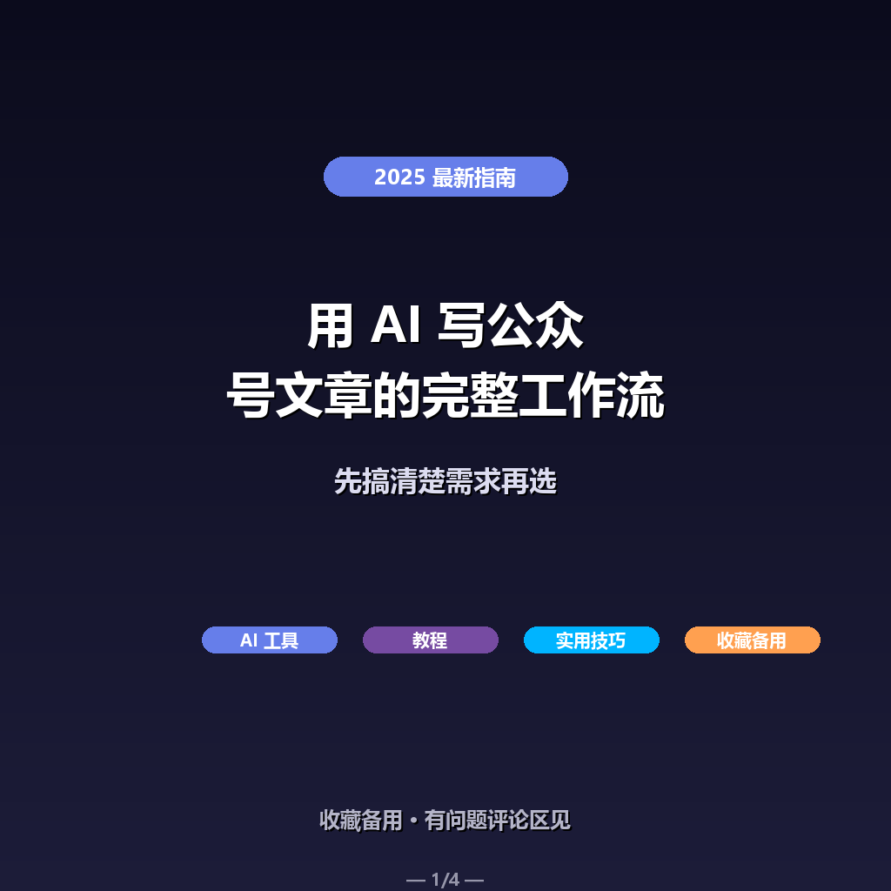
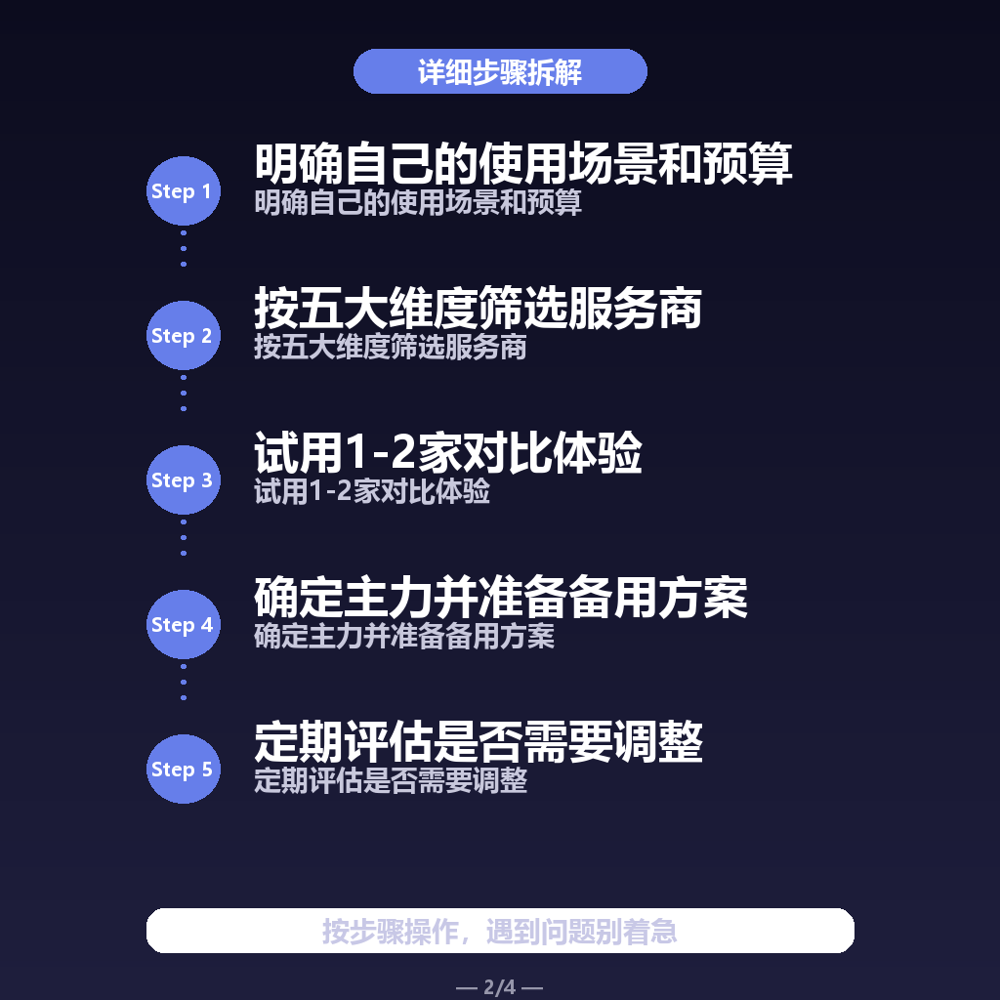
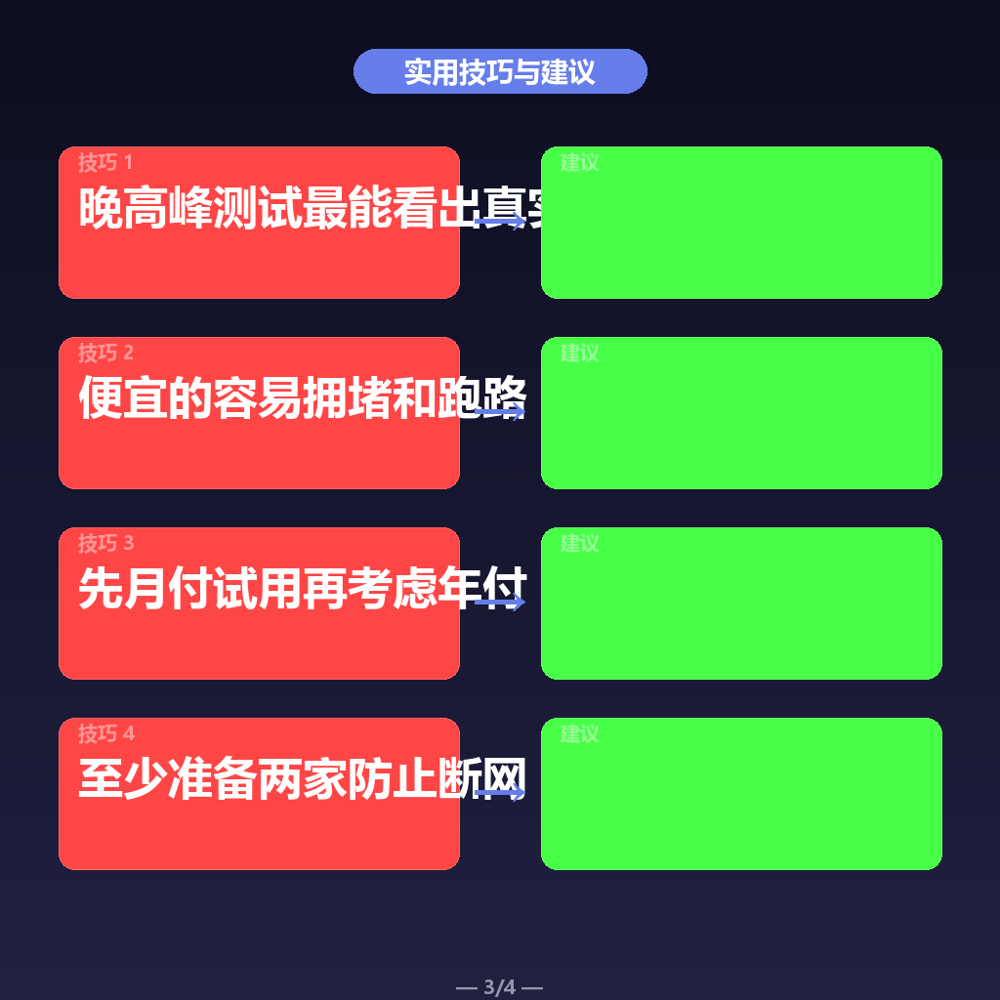
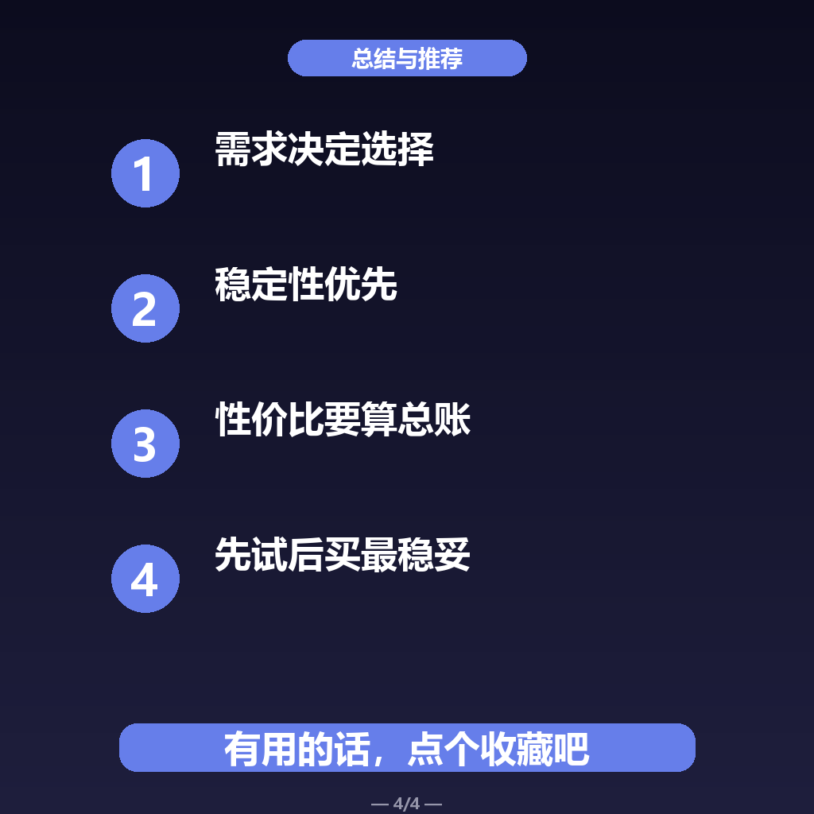

<!--
title: 奈云 IEPL 专线体验：168元年付到底值不值
date: 2026-05-26
type: review
week: 0
style: 对比评测：和同类竞品对比，分析各自的优劣势
fingerprint: 1580f9302929857c88dccef5bb2cec21
tags: 深度评测, 真实体验, 长期使用
-->

  
   2026-05-26 · 深度评测, 真实体验, 长期使用

 

# [奈云](https://api.huanghaiwan.com/go/奈云) IEPL 专线体验：168元年付到底值不值

> 发布日期：2026-05-26 | 本文为示例内容（未配置 API Key）

## 为什么写这篇

最近总有朋友问我同样的问题：热门平价网络服务商评测

我刚开始也是一头雾水，花了些时间研究、试用，踩了不少坑。
这篇把我学到的东西整理出来，希望能帮你少走弯路。

## 我的判断标准

先说说我是怎么衡量一个服务好不好的：

### 1. 稳定性是第一位的

白天能用不算什么，**晚高峰才是试金石**。
我一般会选在工作日晚上 8-10 点测试，这个时段最能看出真实水平。

### 2. 性价比要算总账

不要只看月付价格，要看包含了什么：
- 多少流量
- 多少接入点
- 什么线路类型
- 支持几个设备同时用

### 3. 售后服务很重要

出问题的时候能找到人、能及时解决，这点很关键。
有 TG 群且响应快的，会比只能发工单的省心很多。

## 常见误区

### ❌ 越贵越好
不一定。贵的可能有更好的线路，但不一定适合你的使用场景。
如果你只是刷刷网页看看视频，中档的完全够用。

### ❌ 越便宜越划算
便宜的往往人多拥堵，体验很差。
而且便宜的容易跑路，售后也没保障。

### ❌ 一家就够了
建议至少准备 **主力 + 备用** 两家。
万一哪天主力出问题了，备用顶上，不影响使用。

## 对比评测：和同类竞品对比，分析各自的优劣势

> 按照上面说的标准，结合我自己的使用经验：

**主力推荐方向：**
- 稳定性优先，宁可多花一点也要稳
- 接入点覆盖主流区域
- 有良好的售后支持

**备用推荐方向：**
- 价格实惠
- 做补充使用
- 和主力不同的线路，增加冗余

## 总结

选服务最重要的是**先搞清楚自己的需求**：

| 场景 | 关注重点 | 预算建议 |
|------|---------|---------|
| 日常网页浏览 | 稳定性 | 低-中 |
| 看视频/流媒体 | 速度 + 解锁能力 | 中 |
| 使用 AI 工具 | 稳定性 + 延迟 | 中-高 |
| 下载大文件 | 速度 + 流量 | 中 |

希望这篇对你有帮助。有用的话收藏一下，以后需要的时候方便找。

<!-- article-data
key_points: 先搞清楚需求再选|稳定性比速度更重要|不要只看价格要看综合性价比|建议主力+备用双保险|先试用再付款别冲动
steps: 明确自己的使用场景和预算|按五大维度筛选服务商|试用1-2家对比体验|确定主力并准备备用方案|定期评估是否需要调整
tips: 晚高峰测试最能看出真实水平|便宜的容易拥堵和跑路|先月付试用再考虑年付|至少准备两家防止断网
summary_items: 需求决定选择|稳定性优先|性价比要算总账|先试后买最稳妥|备用方案不可少
-->

---

## 📷 配图

