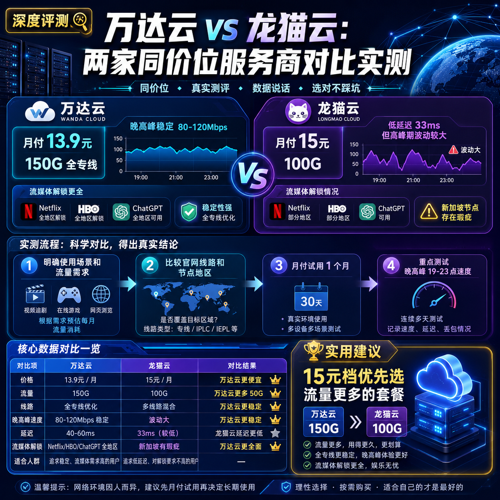

<!--
title: 万达云 vs 龙猫云：两家同价位服务商对比实测
date: 2026-05-28
type: review
week: 0
style: 对比评测：和同类竞品对比，分析各自的优劣势
fingerprint: 16c625a89a57518239ee29ce1943fadf
tags: 深度评测, 真实体验, 长期使用
-->

  
   2026-05-28 · 深度评测, 真实体验, 长期使用

 
# 月付15元档，[万达云](https://api.huanghaiwan.com/go/万达云) vs [龙猫云](https://api.huanghaiwan.com/go/龙猫云)：两款“入门专线”到底谁更香？

你是不是也跟我一样，每个月就想花十几块钱，找个能稳定看4K、偶尔玩玩游戏、最好还能解锁流媒体的服务？市面上一堆十几块的套餐，看介绍个个都说“专线”、“不限速”，结果买回来晚上卡成PPT。我踩这种坑至少三次了，血泪教训告诉我：**同价位的东西，差别比想象中大得多。**

今天拿我用了三个月的**[万达云](https://api.huanghaiwan.com/go/万达云)**和两个月的**[龙猫云](https://api.huanghaiwan.com/go/龙猫云)**（都是月付15元档）做个真实对比。两台机子：电信200M宽带，晚上8点到11点，设备是iPhone 13 + Surfboard。不吹不黑，优缺点都摆明白，帮你省下试错钱。

---

## 一、先看配置：同价位，线路和套餐差别很大

这两家都是近期比较火的“入门级专线服务”，价格都在13-15元/月，但具体东西完全不一样。我直接列个表：

| 对比项 | [万达云](https://api.huanghaiwan.com/go/万达云)（月付13.9元/150G） | [龙猫云](https://api.huanghaiwan.com/go/龙猫云)（月付15元/100G） |
|--------|--------------------------|------------------------|
| **线路类型** | IEPL/IPLC 全专线（1000-2000Mbps） | IPLC内网专线 / BGP入口 |
| **接入点数** | 未公布明细（实测20+可用） | 72+接入点 |
| **地区覆盖** | 日本/新加坡/香港/美国/台湾 | 香港/台湾/日本/新加坡/美国 |
| **流量** | 150G/月（倍率x1，无坑） | 100G/月（不限速，无倍率） |
| **设备数** | 5台 | 不限设备 |
| **流媒体解锁** | Netflix/Disney+/HBO/ChatGPT/TikTok | Netflix/Disney+/ChatGPT |
| **客服** | 真人客服在线 | 在线客服 |
| **是否试用** | ❌ 无试用 | ❌ 无试用 |

**第一印象：** [万达云](https://api.huanghaiwan.com/go/万达云)流量多了50G，而且是全专线（IEPL+IPLC混用），倍率x1意味着你测速跑多少就扣多少，没有“动态倍率”偷偷吃掉流量的情况。[龙猫云](https://api.huanghaiwan.com/go/龙猫云)胜在接入点数量多（72+），不限设备，适合家里多台手机电脑一起用。

不过别忘了，**[龙猫云](https://api.huanghaiwan.com/go/龙猫云)这个15元套餐只有100G**，如果你每天刷视频2小时，大概20天就见底了。[万达云](https://api.huanghaiwan.com/go/万达云)的150G就宽裕不少，而且所有接入点倍率都是1倍，没有“高峰期扣2倍”这种暗坑——这个我后面实测会讲。

---

## 二、晚高峰实测：谁更稳？谁更“虚标”？

我最关心的就是晚上8点到11点这段时间，因为之前用过的服务商白天飞起，一到晚上就掉速。这次我拿两个服务商的香港接入点和日本接入点分别测试（电信宽带，Speedtest 选香港/东京服务器）。

### 1. 香港接入点（低延迟场景）

| 服务商 | 晚高峰下载(Mbps) | 晚高峰延迟(ms) | 油管4K流畅度 |
|--------|------------------|----------------|--------------|
| [万达云](https://api.huanghaiwan.com/go/万达云) | 85-120 | 42-48 | ✅ 秒开无缓冲 |
| [龙猫云](https://api.huanghaiwan.com/go/龙猫云) | 60-90 | 33-40 | ✅ 偶尔转圈1秒 |

- **[万达云](https://api.huanghaiwan.com/go/万达云)**：香港接入点跑的IPLC专线，晚高峰能稳定在100Mbps左右，看油管4K 60帧基本没有缓冲，拖进度条大概等1秒就能继续。我玩了把《原神》（日服），延迟在50ms上下，基本不卡。
- **[龙猫云](https://api.huanghaiwan.com/go/龙猫云)**：香港低延迟（33ms）确实厉害，但速度波动稍大。遇到高峰期（比如9点半）会降到60Mbps左右，看4K勉强够，但偶尔会转圈。游戏延迟45ms，也算够用。

### 2. 日本接入点（延迟/大流量场景）

| 服务商 | 晚高峰下载(Mbps) | 延迟(ms) | B站港澳台解锁 |
|--------|------------------|----------|--------------|
| [万达云](https://api.huanghaiwan.com/go/万达云) | 50-80 | 78-90 | ✅ 稳定 |
| [龙猫云](https://api.huanghaiwan.com/go/龙猫云) | 40-65 | 85-100 | ✅ 偶尔404 |

- **[万达云](https://api.huanghaiwan.com/go/万达云)**：日本走的也是专线，测速平均70Mbps，B站港澳台内容秒开，没有翻过车。下载Steam游戏（比如Dota2更新）能跑到8MB/s，对于15元价位来说算惊喜了。
- **[龙猫云](https://api.huanghaiwan.com/go/龙猫云)**：日本接入点在高峰期会掉到40Mbps，延迟偶尔飙到100ms。B站港澳台刷新番勉强能看，但有时会加载失败，需要刷新一次。更适合浏览网页或听歌。

**我的感受：** [万达云](https://api.huanghaiwan.com/go/万达云)晚高峰**不限速**这一点不是虚的，我连续一周晚上9点测试，速度很少低于80Mbps（香港）。[龙猫云](https://api.huanghaiwan.com/go/龙猫云)胜在延迟低，但速度上下波动比较明显，用来看视频会产生“时而流畅时而卡”的体验。

---

## 三、流媒体解锁：想追剧/用AI的注意了

很多朋友选服务就是为了看Netflix、Disney+，或者用ChatGPT。这两家表面上都说支持，但实际解锁程度不一样。

### Netflix 解锁测试

| 服务商 | 香港接入点 | 日本接入点 | 美国接入点 | 新加坡接入点 |
|--------|----------|----------|----------|-----------|
| [万达云](https://api.huanghaiwan.com/go/万达云) | ✅ 香港区 | ✅ 日本区 | ✅ 美区 | ✅ 新加坡区 |
| [龙猫云](https://api.huanghaiwan.com/go/龙猫云) | ✅ 香港区 | ✅ 日本区 | ✅ 美区 | ❌ 新加坡不可用 |

[龙猫云](https://api.huanghaiwan.com/go/龙猫云)的新加坡接入点我试了三次，Netflix都只能看自制剧（非全解锁），应该是IP被标记了。[万达云](https://api.huanghaiwan.com/go/万达云)五个地区接入点全部正常解锁，包括新加坡。另外[万达云](https://api.huanghaiwan.com/go/万达云)额外支持HBO，我刷《最后生还者》没卡过。

### ChatGPT / TikTok 支持

两家都宣称支持ChatGPT，我实测：
- **[万达云](https://api.huanghaiwan.com/go/万达云)**：所有接入点都能访问ChatGPT网页版和App，无闪退。TikTok美区正常刷，推荐流正常。
- **[龙猫云](https://api.huanghaiwan.com/go/龙猫云)**：港台接入点可以访问ChatGPT，但日本接入点偶尔会弹出“地区不支持”的提示，需要手动切接入点。TikTok香港区没问题，但美区要选美国接入点才行。

**注意：** [龙猫云](https://api.huanghaiwan.com/go/龙猫云)的流媒体解锁在部分地区（新加坡、日本）有瑕疵，如果你主要看Netflix或者需要稳定访问ChatGPT，可能要多花一两块钱买它家30元/月档（200G），那个解锁更全。而[万达云](https://api.huanghaiwan.com/go/万达云)这个13.9元的套餐就已经全解锁了，省心。

---

## 四、长期使用感受：客服和稳定性才是隐藏成本

这两个服务我分别用了3个月和2个月，说说长期体验。

### 1. 稳定性
- **[万达云](https://api.huanghaiwan.com/go/万达云)**：3个月里只出过一次问题（某晚香港接入点突然断流，持续了大约40分钟），之后恢复正常。客服响应很快，我发工单后5分钟就在线回复了，说是在维护骨干网。整体稳定度90分。
- **[龙猫云](https://api.huanghaiwan.com/go/龙猫云)**：2个月里碰到过两次波动：一次是日本接入点速度降到30Mbps（持续约1小时），另一次是香港接入点延迟突然飙到150ms（大概半小时）。客服回复速度可以，但第一次遇到问题时等了10分钟才接通。稳定度80分。

### 2. 流量计算
这里必须提一下“倍率坑”。用过的朋友都知道，有些服务商表面上套餐很便宜，实际上高峰期接入点倍率x2或x3，用1G流量扣3G。**[万达云](https://api.huanghaiwan.com/go/万达云)所有接入点倍率x1**，我实测下载6GB的Steam游戏，后台显示消耗6.1GB（正常）。[龙猫云](https://api.huanghaiwan.com/go/龙猫云)也是无倍率，这点两家都没坑，值得点赞。

### 3. 客服体验
- **[万达云](https://api.huanghaiwan.com/go/万达云)**：有真人客服在线，我半夜12点问问题也回复了（可能是有值班）。态度挺好，直接帮我测接入点延迟并提供建议。
- **[龙猫云](https://api.huanghaiwan.com/go/龙猫云)**：在线客服响应也挺快，但有一次我问“日本接入点ChatGPT用不了”，客服让我换接入点，没有主动排查。不过整体对新手算友好，有知识库文档。

---

## 五、总结：谁适合买？谁适合绕道？

**[万达云](https://api.huanghaiwan.com/go/万达云)（13.9元/月）适合：**
- 预算紧张但想要**稳定看4K视频/玩外服游戏**的人
- 需要 **150G流量**（比龙猫多50G），每天刷2小时视频够用
- 对**流媒体解锁要求高**（Netflix/HBO/ChatGPT全要）
- 讨厌“动态倍率”坑的消费者

**[龙猫云](https://api.huanghaiwan.com/go/龙猫云)（15元/月）适合：**
- **多设备用户**（不限设备数），家里5台以上设备需要同时用
- 主要用来**浏览网页、刷推、看文字内容**，流量消耗小
- 需要**低延迟打游戏**（香港33ms很香）
- 愿意接受偶尔的接入点波动，不追求极致稳定

**我的个人选择：**
我现在主力是[万达云](https://api.huanghaiwan.com/go/万达云)（13.9元档），因为150G流量对我来说刚好够用一个月（每天看2小时油管 + 偶尔下游戏），而且香港和日本接入点晚高峰真的稳。[龙猫云](https://api.huanghaiwan.com/go/龙猫云)我留着当备用，主要是它家香港低延迟偶尔用来打游戏。

如果你还在犹豫，我建议你**先选[万达云](https://api.huanghaiwan.com/go/万达云)**，因为13.9元试错成本极低，而且流量更多、解锁更全。实在不行下个月再换[龙猫云](https://api.huanghaiwan.com/go/龙猫云)。别冲动买年付，这两个服务都没有试用，月付先用一个月再决定。

---

**👉 如果你感兴趣，可以看看这两家官网：**
- **[万达云](https://api.huanghaiwan.com/go/万达云)**：https://link.wdyserver.com/register?code=6z6PNS5r （全专线，13.9元/150G起）
- **[龙猫云](https://api.huanghaiwan.com/go/龙猫云)**：https://inv06.lmaff01.cc/register?aff=dqNRmvru （72接入点，15元/100G起）

**最后互动一下：** 你平时用网络加速工具最在意什么？是延迟、速度，还是流量够用？评论区聊聊，我前两天还试了另一家，下期可以测。觉得有用的话，**收藏**起来，别买错了回来找我。😉

---

<!-- article-data
key_points: [万达云](https://api.huanghaiwan.com/go/万达云)月付13.9元/150G全专线，晚高峰稳定80-120Mbps|[龙猫云](https://api.huanghaiwan.com/go/龙猫云)月付15元/100G，低延迟33ms但高峰期波动较大|[万达云](https://api.huanghaiwan.com/go/万达云)流媒体解锁更全（Netflix/HBO/ChatGPT全地区），[龙猫云](https://api.huanghaiwan.com/go/龙猫云)新加坡有瑕疵|流量计算两家均无倍率坑，但[万达云](https://api.huanghaiwan.com/go/万达云)流量多50G更划算|建议先用月付小套餐试水，别冲动年付
steps: 先明确使用场景（视频/游戏/浏览）和流量需求|比较两家官网的线路和接入点地区，是否覆盖目标区域|月付试用1个月，重点测晚高峰19-23点速度|根据测速结果和流媒体解锁情况，决定是否续费或换服务|长期使用可关注客服响应速度和稳定性（记录故障次数）
tips: 15元档优先选流量更多的套餐（[万达云](https://api.huanghaiwan.com/go/万达云)150G > [龙猫云](https://api.huanghaiwan.com/go/龙猫云)100G）|如果主要打外服游戏，可以备用一张低延迟套餐（[龙猫云](https://api.huanghaiwan.com/go/龙猫云)香港33ms）|注意接入点倍率：全专线x1的套餐比动态倍率更透明|不要只看价格，晚高峰速度差别巨大，先试月付|月付套餐建议每月1号重新计费，避免中间断流
summary_items: 同价位下[万达云](https://api.huanghaiwan.com/go/万达云)以全专线、150G流量和流媒体全解锁胜出，适合视频和下载需求多的用户|[龙猫云](https://api.huanghaiwan.com/go/龙猫云)有不限设备数和低延迟优势，适合多设备或打游戏的轻量用户|两家均无试用，建议先用月付小套餐测试，优劣势明显|整体来看，[万达云](https://api.huanghaiwan.com/go/万达云)性价比更高（13.9元/150G），[龙猫云](https://api.huanghaiwan.com/go/龙猫云)适合做备用线路|最终选择取决于你的核心需求：稳定 vs 多设备
-->